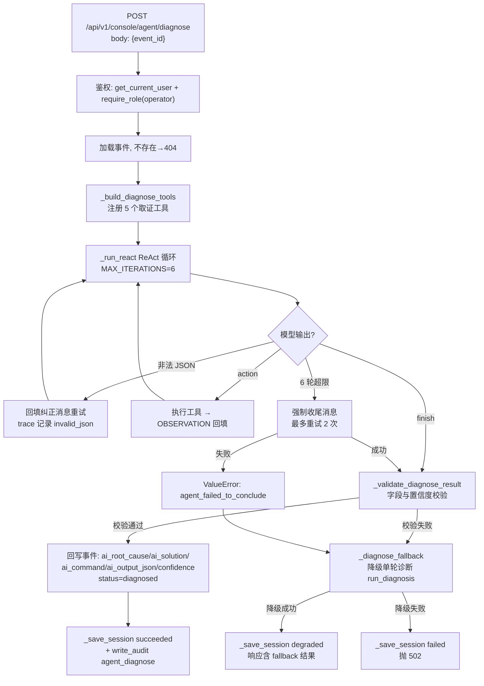
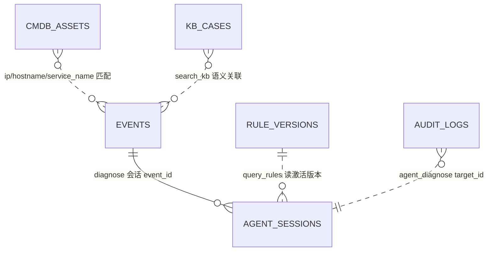

# 深度诊断 Agent（Diagnose Agent）现状设计说明书

| 项目 | 内容 |
|------|------|
| 文档版本 | v1.0（现状实录 as-is） |
| 编写日期 | 2026-09-14 |
| 覆盖范围 | `app/backend` 深度诊断 Agent 端到端链路（ReAct 多轮推理 → 五大工具取证 → 结论校验回写 → 单轮诊断降级） |
| 姊妹文档 | 《知识治理 Agent 现状设计说明书》（`docs/KB_GOVERNANCE_AGENT_DESIGN.md`）、《值班 Agent 现状设计说明书》（`docs/ONCALL_AGENT_DESIGN.md`） |

---

## 1. 系统定位与业务目标

深度诊断 Agent 是运营控制台三类运维 Agent 之一（深度诊断 / 知识治理 / 值班报告），面向**单条告警的根因分析**。与传统单轮诊断（`console_ai.run_diagnosis`：召回 → 一次性 LLM 输出）相比，深度诊断 Agent 引入 **ReAct 多轮工具调用**：模型像 SRE 一样分步取证——看告警详情 → 查 CMDB 归属 → 翻最近日志 → 对照分类规则 → 搜索知识库——再下结论。

业务目标：

1. **多轮取证替代单轮猜测**：结论必须建立在至少 2 条工具观察证据之上，抑制幻觉；
2. **CMDB 关联归属**：自动将告警主机/服务映射到系统、负责人、日志路径；
3. **结论结构化回写**：根因 / 处置建议 / 置信度 / 可执行命令持久化到事件表，供控制台展示与后续反馈闭环使用；
4. **可用性优先**：Agent 多轮推理失败自动降级为既有单轮诊断，两条路径全失败才对外报错；
5. **全程可回放**：每轮 thought / tool / args / observation 持久化为工具轨迹，事后可审计推理过程。

设计哲学：**模型只负责推理，事实全部来自工具**；每个工具失败不终止推理（返回错误观察让模型自行调整）；慢速 LLM 调用前提交数据库事务，避免长事务。

---

## 2. 总体架构与运行链路

### 2.1 代码位置

| 职责 | 文件 |
|------|------|
| API 路由（权限校验） | `app/backend/routers/console_agent.py` → `POST /api/v1/console/agent/diagnose` |
| ReAct 引擎 + 工具集 + 编排 | `app/backend/services/console_agent.py` → `_run_react` / `_build_diagnose_tools` / `run_diagnose_agent` |
| 单轮诊断降级 | `app/backend/services/console_ai.py` → `run_diagnosis`（业务评分召回 + Embedding 加分 + 单次 LLM） |
| LLM 接入层 | `app/backend/services/llm_runtime.py` → `llm_chat`（配置中心驱动，atoms_hub / openai_compatible） |
| 会话模型 | `app/backend/models/agent_sessions.py` |
| 前端入口 | `app/frontend/src/pages/console/AgentsPage.tsx` →「深度诊断」Tab |

### 2.2 运行链路



---

## 3. API 契约

### 3.1 运行深度诊断

- **端点**：`POST /api/v1/console/agent/diagnose`
- **权限**：`require_role(db, user, "operator")` —— `operator` 及以上（operator / sre / approver / kb_admin / sys_admin）
- **请求体**：`{ "event_id": 12 }`（`Events.id` 数据库主键；不存在返回 404 *"事件不存在"*）

- **成功响应（200，status=success）**：

```json
{
  "status": "success",
  "session_id": 2,
  "event_id": 12,
  "message": "Agent 深度诊断完成",
  "agent": {
    "model": "deepseek-v4-flash",
    "iterations": 4,
    "duration_ms": 8213.45,
    "tool_trace": [
      {"iteration": 1, "thought": "...", "tool": "get_alert_detail", "args": {}, "observation": {...}},
      {"iteration": 2, "thought": "...", "tool": "query_cmdb", "args": {"service_name": "user-service"}, "observation": {...}}
    ],
    "conclusion": {
      "root_cause": "根因结论（中文）",
      "solution": "处置建议（中文，分步骤）",
      "confidence": 0.86,
      "evidence_chain": ["证据1", "证据2"],
      "command": "redis-cli info persistence",
      "low_confidence": false,
      "threshold": 0.75
    }
  }
}
```

- **降级响应（200，status=degraded）**：`agent: null`，`fallback` 字段携带单轮诊断完整结果，message 为 *"Agent 多轮推理失败，已降级为单轮诊断"*。
- **全失败**：502，detail = *"Agent 诊断失败且降级诊断不可用：\<错误\>"*。

### 3.2 关联只读接口

| 端点 | 用途 |
|------|------|
| `GET /api/v1/console/agent/sessions?session_type=diagnose` | 会话轨迹回放（含每轮 thought/tool/observation） |
| `GET /api/v1/console/agent/cmdb?q=` | CMDB 资产查询（Agent 工具的数据源，也可人工核查） |
| `GET /api/v1/console/events` | 事件列表（前端选择待诊断事件） |

---

## 4. ReAct 多轮推理引擎

实现：`console_agent._run_react(db, system_prompt, task_prompt, tools)`。该引擎是通用组件（当前仅诊断 Agent 使用）。

### 4.1 每轮循环

1. `_flush(db)`：提交当前数据库事务（会话边界规范——慢速 LLM 调用前释放事务）；
2. 调用 `_llm_chat`（模型/温度/超时由配置中心驱动，默认超时 45s，`max_tokens=1600`）；
3. `extract_json_payload` 容错解析（容忍 Markdown 代码块包裹、截取首尾大括号）；
4. 按输出类型分支：

| 输出 | 处理 |
|------|------|
| 非法 JSON | trace 记录 `{iteration, error: "invalid_json", raw: 前400字符}`；追加纠正消息（*"上一轮输出不是合法 JSON…"*）继续下一轮 |
| `{"thought", "action": {tool, args}}` | 执行工具 → 观察回填，继续下一轮 |
| `{"thought", "finish": true, "result"}` | `_normalize_finish_result` 归一化后返回 `{result, iterations, trace, elapsed_ms}` |

5. 工具执行保护：
   - 未注册工具 → 观察 `{"error": "未知工具 X", "available": [可用工具列表]}`；
   - 工具抛异常 → 观察 `{"error": "工具执行失败: <类型>: <消息>"}`（**单个工具失败不终止推理**）；
6. 消息回填：观察 JSON 序列化**截断至 4000 字符**，以 `assistant`（模型上轮输出）+ `user`（OBSERVATION + 继续指令）双消息追加。

### 4.2 超限强制收尾

达到 `MAX_ITERATIONS = 6` 轮仍未 `finish`：追加强制收尾消息（"已达最大推理轮数…立即输出 finish JSON"），**最多重试 2 次**；仍失败抛 `ValueError("agent_failed_to_conclude")`，进入降级路径。该设计避免单次输出抖动导致整体失败。

### 4.3 finish 归一化

`_normalize_finish_result` 兼容两种形态：结论嵌套在 `result` 对象内（标准），或 `root_cause/solution/…` 直接放在顶层——顶层字段以 `setdefault` 合并，两者皆可被校验器接受。

### 4.4 系统提示词（DIAGNOSE_AGENT_SYSTEM_PROMPT）

约束要点：

- 只能通过工具获取信息，必须多轮取证后再下结论；
- 每轮只输出一个 JSON 对象，禁止 Markdown 或多余文本；
- **推理纪律**：第一轮必须调用 `get_alert_detail`；需要主机归属时调用 `query_cmdb`（优先用告警中的 IP/主机名，否则用 service_name）；结论必须给出**至少 2 条证据链**（来自工具观察）；**不得编造工具未返回的事实**。

任务提示（task_prompt）动态构造：`event_id`（业务 ID + 数据库主键）、建议流程（get_alert_detail → query_cmdb → read_recent_logs / query_rules / search_kb → finish）、"证据足够时尽快 finish，不要为用满轮数继续调用工具"、结论 150 字限制。

---

## 5. 五大取证工具设计

实现：`console_agent._build_diagnose_tools(db, event)`。工具观察是模型唯一的事实来源。

### 5.1 `get_alert_detail`（告警详情，第一轮必调）

返回：event_id / severity / service_name / cluster / error_type / template / raw_log / topology / status，以及两类自动提取的主机线索：

| 线索 | 提取方式 |
|------|----------|
| `extracted_ips` | 正则 `\b(?:\d{1,3}\.){3}\d{1,3}\b` 匹配 raw_log，去重排序 |
| `extracted_host_tokens` | 模板+日志中的标识符（`[A-Za-z][A-Za-z0-9\-_]{2,}`），且命中服务类关键词（db/svc/gw/cache/redis/gateway/service/collector/proxy/node，忽略大小写），最多 8 个 |

另返回 `prior_single_round_diagnosis`（事件此前单轮诊断的 JSON，若有）与提示语（extracted_ips 为空时建议用 service_name 查 CMDB）。

### 5.2 `query_cmdb`（资产归属）

- 参数：`ip` / `hostname` / `service_name` 至少其一，否则返回 error 观察；
- 查询策略：**精确匹配**（ip/hostname/service_name 三列任一）→ 无结果时 **ilike 模糊匹配**（hostname/service_name/system_name）；
- 返回 `matches` 最多 5 条资产：系统、服务、集群、环境、负责人（姓名+邮箱）、依赖组件（JSON）、日志路径、状态、描述。

### 5.3 `read_recent_logs`（最近日志样本）

- 参数：`service_name`（可选 `limit`，默认 10，**上限 20**）；service_name 缺省时可传 ip/hostname，经 CMDB 解析到服务；
- 数据源：`events` 表中该服务最近记录（`id desc`，取 `limit×3` 条），`raw_log` 去重后最多 `limit` 条，附 severity / created_at；
- 返回 note 说明：样本来自告警事件库，完整日志可按 CMDB `log_path` 上机核查（**不直接读日志文件**）。

### 5.4 `query_rules`（激活分类规则）

- 取 `rule_versions` 中 `status='active'` 的最高版本；
- 经 `console_kb._extract_rule_docs` 解析校验 YAML；
- 可按 `keywords` 过滤（小写包含匹配整条规则 JSON 文本）；
- 返回规则条目（id / error_type / score / severity / keywords），最多 20 条。

### 5.5 `search_kb`（相似知识案例）

- 范围：`status != 'archived'` 的全部知识案例；
- 过滤：`error_type` / `service_name` 精确匹配（传入时）；
- 评分：复用 `console_ai.score_case`（六信号加权，见 §7.2），`score <= 0` 剔除；
- 归一化：`min(0.99, raw/6.0)`，返回 Top-5（case_id / error_type / service_name / alert_template / root_cause / solution / score）。

---

## 6. 结论校验与事件回写

### 6.1 校验规则 `_validate_diagnose_result`

| 字段 | 规则 |
|------|------|
| `root_cause` / `solution` | 字符串 strip 后非空，否则整体判无效 |
| `confidence` | 可转 float；**>1 且 ≤100 自动除以 100**（兼容百分制）；最终须在 [0,1]，否则无效 |
| `evidence_chain` | 列表内逐项 str/strip，截取前 10 条 |
| `command` | 字符串 strip，可为空 |

校验失败 → `loop_error="invalid_agent_conclusion"`，进入降级。

### 6.2 事件回写（成功路径）

```python
event.ai_root_cause = conclusion["root_cause"]
event.ai_solution   = conclusion["solution"]
event.ai_command    = conclusion["command"] or None
event.ai_output_json = json.dumps({**conclusion, "agent": True})   # 标记 Agent 来源
event.confidence    = conclusion["confidence"]
event.status        = "diagnosed"
event.degraded_reason = None if confidence >= threshold else f"low_confidence(<{threshold})"
```

`threshold` 来自配置中心 `confidence_threshold`（默认 **0.75**）。低置信度不阻断流程——事件仍标记 `diagnosed`，但 `degraded_reason` 留痕，控制台展示"低置信度"徽标，提示人工复核。

### 6.2.1 置信度与 Trust Index 口径区分

| 维度 | 置信度（confidence） | Trust Index |
|------|---------------------|-------------|
| 统计对象 | 模型对**本次根因结论**的自评把握度 | 生成内容与检索证据的**客观一致性评分** |
| 计算来源 | LLM 输出的 self-rated 置信度字段（六信号评分） | `T = 0.4×Faithfulness + 0.35×Citation Accuracy + 0.25×(1−幻觉率)`（启发式比对器；实现中引用口径以 Context Coverage 度量） |
| 判定阈值 | `confidence_threshold` = 0.75（低于即提示人工复核） | `GATE_LINE` = 0.85（单次质量线，与运维告警线一致） |
| 语义 | 主观概率："我认为根因是 X 的可能性有多大" | 客观质量："结论的每个断言是否都能在召回案例/日志中找到依据" |
| 典型矛盾场景 | 高置信度 + 低 Trust Index：模型对错误结论很自信，断言缺证据支撑 | 低置信度 + 高 Trust Index：结论谨慎但每条断言均有引用，可放心采信 |

两者**独立衡量、不构成矛盾**。控制台在 Agent 结论卡片同时展示置信度徽标与质量评估卡，任一未达标均建议人工复核。同一口径已复用于知识治理 Agent（起草案例质量）与值班 Agent（报告质量）。

### 6.3 会话与审计

- `_save_session`：`session_type=diagnose`、`status=succeeded`、`model`、`event_id`、`result={conclusion, threshold, quality}`、`tool_trace`（完整每轮轨迹，≤20000 字符）、`iterations`、`duration_ms`、`actor`、`summary=root_cause[:300]`；
- `write_audit`：`action=agent_diagnose`、`target_type=event`、`target_id=事件主键`、`after={session_id, model, iterations, confidence, low_confidence, trust_index}`。

---

## 7. 单轮诊断降级链路

实现：`console_ai.run_diagnosis`（Agent 失败时的 fallback，也是控制台"快速诊断"按钮的既有路径）。

### 7.1 流程

1. **业务召回**：加载全部非 archived 案例 → `build_candidates` 六信号评分 → Top-3（score 归一化 0~0.99）；
2. **Embedding 语义加分**（可选）：配置中心 `embedding_base_url/api_key/model` 齐全才启用；对告警文本与候选案例文本批量向量化，余弦相似度 > 0 时 `score += 0.5 × sim` 并重排；**调用失败静默降级**（返回 None，不阻断）；
3. **无相似案例**：`rag_status=unknown`、`degraded_reason=no_similar_case`、`event.status=unknown`，返回提示"补充知识案例或晋升规则"（不调 LLM）；
4. **LLM 诊断**：读阶段提交事务后调用（`max_tokens=1200`，超时 `llm_timeout_seconds`）；非法/校验失败**重试 1 次**；
5. **回写与审计**：字段与深度诊断相同（`ai_output_json` 无 `agent: true` 标记），audit `action=diagnosis_run`。

### 7.2 六信号业务评分（score_case）

| 信号 | 权重 |
|------|------|
| `error_type` 完全一致 | +3.0 |
| `service_name` 一致 | +2.0 |
| `cluster` 一致 | +0.5 |
| `topology_snapshot` 一致 | +0.5 |
| 模板 token 重叠 | +min(2.0, 重叠数×0.5) |
| `feedback_score` | ±clamp(±0.5)，按 ×0.25 折算 |

满分 6.0，除以 6 归一化。

### 7.3 失败语义（与 Agent 的衔接）

| 失败点 | 行为 |
|--------|------|
| LLM 超时 | `rag_status=degraded`、`degraded_reason=llm_timeout`，抛 504（提示调大 `llm_timeout_seconds`） |
| LLM 其他异常 | `degraded_reason=llm_error:<类型>`，抛 502（提示重试） |
| JSON 校验失败（重试后） | `degraded_reason=invalid_json_output`，抛 502 |

降级包装 `_diagnose_fallback` 捕获上述异常：`run_diagnosis` 成功 → 会话 `status=degraded`、`result={fallback: "single_round_diagnosis", diagnosis, fallback_error}`、`iterations=0`、`error_message` 记录 Agent 层失败原因；`run_diagnosis` 也失败 → 会话 `status=failed`，对外抛 502。

---

## 8. LLM 配置接入

与知识治理/值班 Agent 共用 `llm_runtime`（每次请求实时读库，配置变更立即生效）。三个 Agent 均支持**独立 LLM 接入配置**：`diagnose_llm_provider` / `diagnose_llm_base_url` / `diagnose_llm_api_key`（留空逐项继承全局 `llm_provider` / `llm_base_url` / `llm_api_key`；atoms_hub 默认 / openai_compatible；api_key Fernet 加密、脱敏展示），支持诊断 Agent 单独切换自建网关而不影响其他 Agent。模型/温度/超时同样独立：`diagnose_llm_model`（留空继承全局，默认 `deepseek-v4-flash`）、`diagnose_temperature`（默认 0）、`diagnose_llm_timeout_seconds`（留空继承全局，默认 45，范围 10~300）。配置中心提供按 Agent 连通性测试（`POST /api/v1/console/configs/llm-test?agent=diagnose`），返回 `resolved_model` / `resolved_provider` / `resolved_base_url` / `resolved_timeout_seconds` / `access_source`（agent|global），API Key 永不回显。

**诊断独立温度覆盖（波动治理）**：诊断 Agent 额外引入独立配置键 `diagnose_temperature`（默认 `0`），ReAct 推理、格式纠错与超限强制收尾的全部 LLM 调用统一使用该温度（`_run_react`/`_conclude_react` 全链路透传），与治理/值班 Agent 使用的 `llm_temperature`（0.2）相互独立。默认 0 保证同一事件重复深度诊断输出稳定；如需更强的多路径探索可调高（合法范围 clamp 到 [0, 2]，空/非法值回退 0）。

**诊断墙钟时间预算（波动治理 P0，Cloudflare 502 防护）**：诊断 Agent 额外引入独立配置键 `diagnose_time_budget_seconds`（默认 `90`，合法范围 30~600，空/非法/NaN 回退 90）。单次 LLM 调用超时（`llm_timeout_seconds`）约束不了"多轮推理 × 强制收尾 × 降级"的时长叠加，LLM 变慢时整体请求可达数百秒，越过边缘代理（如 Cloudflare 默认 100s）后表现为 502。预算语义：`run_diagnose_agent` 起点计算绝对 deadline 透传 `_run_react`，每轮开始前余量 < 12s 停止继续推理转入强制收尾（trace 记录 `budget_exceeded`）；收尾阶段余量 < 5s 抛 `agent_time_budget_exhausted`，单次收尾 LLM 超时截断为 min(剩余预算, 配置超时)；循环内每次推理调用的超时同样按剩余预算截断（min(配置超时, 剩余预算-预留)，下限 8s），防止预算末尾的单次长调用越界；降级阶段余量 < 15s 跳过 LLM 单轮诊断，直接返回结构化 502 `diagnose_time_budget_exhausted` 供前端提示重试，降级执行时剩余预算以 deadline 形式透传 `run_diagnosis`，其内部的 Embedding 加分与每次 LLM 尝试同样按剩余预算截断。单轮诊断直连路由（POST /events/{id}/diagnose）自同一配置键自建预算，预算耗尽返回结构化 502 并落 `degraded_reason=diagnose_time_budget_exhausted`。预算值应小于部署链路中最短的超时（边缘代理/Nginx/网关）；快照 `model_params.time_budget_seconds` 与审计 after 持久化每次实际预算，便于事后归因。

---

## 9. 降级策略矩阵

| 环节 | 失败场景 | 降级行为 | 会话状态 |
|------|----------|----------|----------|
| 事件加载 | event_id 不存在 | 404（不落会话） | 无 |
| ReAct 循环 | 单工具异常 | 错误观察回填，推理继续 | 不受影响 |
| ReAct 循环 | 非法 JSON | 纠正消息重试（占轮次） | 不受影响 |
| ReAct 循环 | 6 轮未收敛 / 收敛输出校验失败 / LLM 超时异常 | 进入单轮诊断 fallback | 落 degraded/failed |
| 单轮诊断 | 无相似案例 | 返回 unknown 结果（非异常） | degraded（fallback 有效） |
| 单轮诊断 | 超时 / 网络非法 JSON | fallback 抛错 → 502 | failed |
| 会话落库 | 数据库异常 | 不吞异常，整体 500 | 不落（依赖后端日志） |

---

## 10. 数据模型与字段回写

### 10.1 `agent_sessions`（diagnose 会话实际取值）

| 字段 | 成功 | 降级 | 失败 |
|------|------|------|------|
| `status` | succeeded | degraded | failed |
| `iterations` | 实际轮数（1~7） | 0 | 0 |
| `tool_trace` | 每轮 {iteration, thought, tool, args, observation} | `[]` | `[]` |
| `result_json` | {conclusion, threshold} | {fallback, diagnosis, fallback_error} | 同降级（diagnosis=null） |
| `error_message` | null | Agent 层失败原因 | Agent 层失败原因 |
| `summary` | root_cause 前 300 字 | "Agent 多轮推理失败，已降级为单轮诊断" | "Agent 与降级诊断均失败" |

### 10.2 `events` 诊断相关字段

| 字段 | 写入方 | 说明 |
|------|--------|------|
| `ai_root_cause` / `ai_solution` / `ai_command` | 两条路径 | 结论三件套 |
| `ai_output_json` | 两条路径 | 完整 JSON（Agent 路径含 `"agent": true`） |
| `confidence` | 两条路径 | 0~1 |
| `status` | 两条路径 | `diagnosed`；无相似案例时 `unknown` |
| `degraded_reason` | 两条路径 | `low_confidence(<0.75)` / `no_similar_case` / `llm_timeout` / `llm_error:*` / `invalid_json_output:*` |
| `rag_status` / `rag_score` / `rag_ms` / `candidates_json` | 单轮诊断 | 召回状态/得分/耗时/Top-3 候选 |
| `template` / `raw_log` / `severity` / `service_name` / `cluster` / `topology` / `error_type` | 标准化入库 | 工具取数的数据源 |

### 10.3 表关系



---

## 11. 权限模型

- **触发**：`operator` 及以上（值班运维即可发起深度诊断；viewer 只读）；
- **会话查看**：`viewer` 及以上（`GET /sessions`）；
- **审计身份**：`actor = user.email or user.id`；
- 角色层级与防越权规则（default_role 禁设 sys_admin 等）与知识治理 Agent 一致（见其 §13）。

---

## 12. 控制台前端操作路径

页面：`app/frontend/src/pages/console/AgentsPage.tsx` →「深度诊断」Tab：

1. **选择事件**：加载最近 7 天事件列表（`listEvents({limit: 50, time_range: '7d'})`），支持按 event_id 输入定位；
2. **运行**：点击诊断按钮（`perms` 控制），运行中显示进行中提示；
3. **结果展示**：
   - 结论卡片：根因 / 处置建议 / 置信度徽标（ConfidenceBadge）/ 证据链列表（E1、E2…编号展示）/ 可执行命令（CopyButton 一键复制）；
   - 工具轨迹：`TraceSteps` 按轮次展示 thought → tool(args) → observation，可回放完整推理过程；
   - 低置信度时展示阈值提示；
4. **降级展示**：`status=degraded` 时展示 fallback（单轮诊断）结果，标注降级原因；
5. **会话轨迹 Tab**：按 `session_type=diagnose` 查看历史会话（状态 / 模型 / 迭代数 / 耗时 / 完整轨迹 JSON）。

API 封装：`consoleApi.agentDiagnose(eventId)` → `POST /api/v1/console/agent/diagnose`。

---

## 13. 典型运行场景

| # | 场景 | 触发条件 | 表现 | 实测证据 |
|---|------|----------|------|----------|
| 1 | 多轮诊断成功 | 事件含主机线索/服务可查 CMDB | 3~5 轮收敛，结论含 ≥2 证据链，事件 status=diagnosed | 会话 #2：user-service GET session 超时 → 判定 Redis AOF rewrite fork 阻塞/负载压力，非应用缺陷 |
| 2 | 幂等重跑 | 对已诊断事件再次运行 | 覆盖旧结论，`prior_single_round_diagnosis` 提供历史参考 | — |
| 3 | CMDB 未登记 | 工具查询无命中 | 观察返回 matches=[] + 引导提示，模型改用其他线索 | — |
| 4 | 无相似案例降级 | 单轮诊断召回为空 | degraded 响应，fallback.status=unknown，提示补案例/晋升规则 | 事件分布 unknown=3 |
| 5 | 6 轮不收敛 | 模型反复调用工具 | 强制收尾（重试 2 次）→ 失败则降级单轮 | 设计路径 |
| 6 | LLM 全面不可用 | Agent 与单轮诊断均超时 | 502，会话 status=failed，事件保持原状态 | 设计路径 |
| 7 | 低置信度 | confidence < 0.75 | 仍标记 diagnosed，degraded_reason 留痕，前端低置信度徽标 | 设计路径 |

---

## 14. 已知问题、风险、监控指标与改进建议

### 14.1 已知问题与风险

| # | 问题/风险 | 影响 | 缓解现状 |
|---|-----------|------|----------|
| 1 | `search_kb` 全量加载非 archived 案例后内存过滤 | 案例量大时工具延迟上升 | 演示规模（12 条）无感；与 RAG 流水线（Milvus+四层重排）为两套体系，控制台侧是简化评分 |
| 2 | 工具观察截断 4000 字符 / 轨迹与结果截断 20000 字符 | 超长日志可能丢失细节 | raw_log 本身在事件表有限长；轨迹有 trace 兜底 |
| 3 | 非法 JSON 重试消耗轮次（无独立重试预算） | 极端情况 6 轮全部耗在格式错误上 | 强制收尾 + 降级兜底 |
| 4 | `read_recent_logs` 数据源是告警事件库而非真实日志文件 | 日志覆盖受限于已接入的告警 | note 中已明示按 CMDB log_path 上机核查 |
| 5 | confidence 校验兼容 0~100，>100 直接无效 | 模型输出 0~10 制度会判无效进降级 | 概率低；prompt 已限定 0.0~1.0 |
| 6 | 降级链路两层 LLM 调用（Agent + 单轮）串行 | LLM 全面故障时用户等待最长约 2×timeout | 超时默认 45s；502 响应含两层错误信息 |

### 14.2 监控建议

| 指标 | 来源 |
|------|------|
| 诊断成功率 / 降级率 / 失败率 | `agent_sessions where session_type='diagnose'` 按 status 聚合 |
| 轮次与耗时分布 | `iterations`、`duration_ms` 分位数 |
| 低置信度率 | `events.degraded_reason like 'low_confidence%'` 占比 |
| 工具调用频次与错误率 | `tool_trace` 内 tool 计数 / observation 含 error 的比例 |
| 单轮诊断 RAG 质量 | `events.rag_status` / `rag_score` / `rag_ms` 分布 |
| 降级原因分布 | `result_json.fallback_error`、`degraded_reason` 分类计数 |

### 14.3 后续改进建议（按优先级）

1. **search_kb 接入四层重排**：调用 RAG 流水线（L1→L4）替代简化 score_case，与 `aiops-rag-system` 能力对齐；
2. **格式重试与轮次解耦**：非法 JSON 重试不计入 MAX_ITERATIONS（设独立小预算）；
3. **证据交叉校验**：校验 evidence_chain 是否能在 tool_trace 观察中找到来源，进一步压幻觉；
4. **并行工具调用**：允许模型单轮声明多个独立工具（如 query_cmdb + query_rules），压缩端到端延迟；
5. **失败会话兜底**：会话落库异常时仍尝试以独立事务记录 failed 行；
6. **token usage 入会话**：`llm_chat` 已返回 usage，透传 `_run_react` 记录成本。

---

## 附录 A：关键配置项速查

| 配置键（console_configs） | 默认 | 与诊断 Agent 的关系 |
|---------------------------|------|---------------------|
| `llm_model` | `deepseek-v4-flash` | ReAct 推理与单轮诊断共用 |
| `llm_timeout_seconds` | `45` | 每轮/每次调用超时 |
| `llm_temperature` | `0.2` | 治理/值班 Agent 采样温度（诊断 Agent 不使用） |
| `diagnose_temperature` | `0` | 诊断 Agent 独立采样温度：全链路固定，默认 0 保证重复诊断确定性 |
| `diagnose_time_budget_seconds` | `90` | 诊断墙钟预算（30~600）：多轮推理+强制收尾总时长上限，余量不足停止推理/跳过降级，预算耗尽返回结构化 502（防 LLM 变慢时请求越过边缘代理超时） |
| `confidence_threshold` | `0.75` | 低置信度判定阈值 |
| `embedding_base_url` / `embedding_api_key` / `embedding_model` | 空（未启用） | 单轮诊断 Embedding 加分开关 |
| `llm_provider` / `llm_base_url` / `llm_api_key` | `atoms_hub` | 全局默认接入方式（诊断 Agent 未配置独立项时生效） |
| `diagnose_llm_provider` / `diagnose_llm_base_url` / `diagnose_llm_api_key` | 空 | 诊断 Agent 独立接入（留空逐项继承全局；api_key Fernet 加密、脱敏展示） |

## 附录 B：复现命令（演示环境）

```bash
TOKEN=$(curl -s -X POST http://localhost:8000/api/v1/auth/demo-login \
  -H "Content-Type: application/json" \
  -d '{"email": "demo-operator@atoms.dev"}' | python3 -c "import sys,json;print(json.load(sys.stdin)['token'])")

# 运行深度诊断（event_id 为 events 表主键）
curl -s -X POST http://localhost:8000/api/v1/console/agent/diagnose \
  -H "Authorization: Bearer $TOKEN" -H "Content-Type: application/json" \
  -d '{"event_id": 12}'

# 查看诊断会话轨迹
curl -s "http://localhost:8000/api/v1/console/agent/sessions?session_type=diagnose&limit=5" \
  -H "Authorization: Bearer $TOKEN"
```
