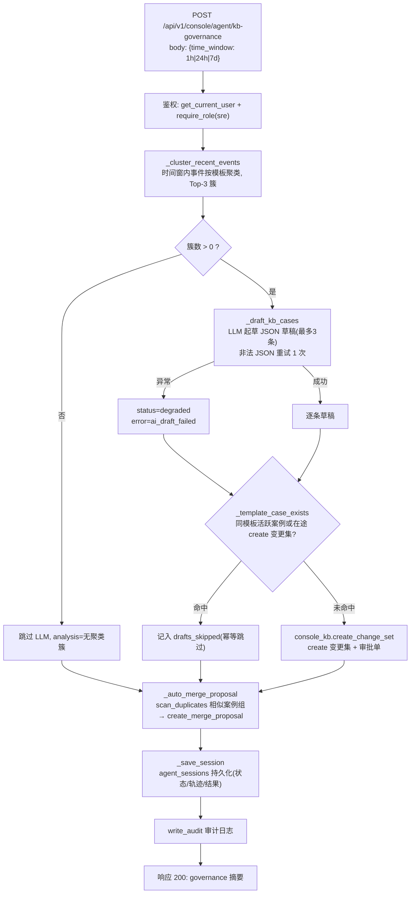
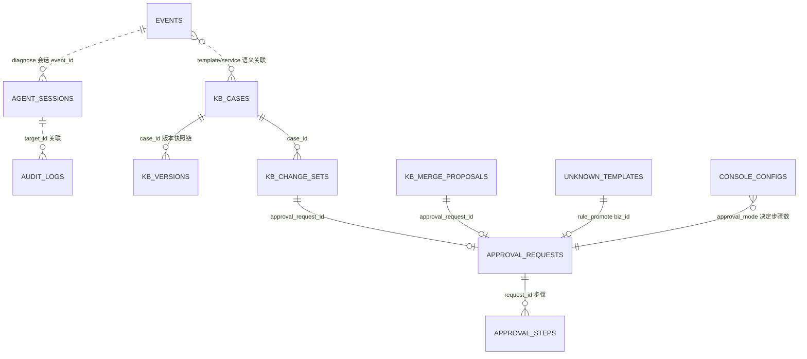

# 知识治理 Agent（KB Governance Agent）现状设计说明书

| 项目 | 内容 |
|------|------|
| 文档版本 | v1.0（现状实录 as-is） |
| 编写日期 | 2026-09-14 |
| 覆盖范围 | `app/backend` 知识治理 Agent 端到端链路（API → 聚类 → AI 起草 → 审批 → 合并提案 → 持久化） |
| 本轮变更 | 修复种子数据导致的主键序列不同步故障；`seed_console_demo.py` 增加自动序列重置 |

---

## 1. 系统定位与业务目标

知识治理 Agent 是 RootSleuth 运营控制台三类运维 Agent（深度诊断 / 知识治理 / 值班报告）之一，与 RAG 诊断流水线（`aiops-rag-system/`）互补：RAG 负责单条告警的实时诊断，知识治理 Agent 负责从**批量告警中沉淀可复用的知识资产**。

业务目标：

1. **自动发现重复告警模式**：按告警模板对时间窗内事件聚类，找出反复出现的故障簇；
2. **AI 起草知识案例**：用 LLM 对信息充分的簇归纳根因与处置建议，形成案例草稿；
3. **人审兜底**：草稿以 `create` 变更集形式进入审批流，AI 不直接写知识库，审批通过后才发布生效；
4. **自动去重**：扫描相似活跃案例并自动提交合并提案，抑制知识库冗余膨胀；
5. **全程可审计、可回放**：每次运行持久化 Agent 会话（状态 / 轨迹 / 结果 / 耗时），关键动作写审计日志。

设计哲学：**可用性优先 + 人审兜底 + 幂等防重复**。AI 失败只降级不阻断；任何写入都走审批或幂等检查；重复运行不会产生重复资产。

---

## 2. 总体架构与运行链路

### 2.1 代码位置

| 职责 | 文件 |
|------|------|
| API 路由（权限校验） | `app/backend/routers/console_agent.py` → `POST /api/v1/console/agent/kb-governance` |
| Agent 核心实现 | `app/backend/services/console_agent.py` → `run_kb_governance_agent` 及私有函数 |
| 知识库工作流 | `app/backend/services/console_kb.py` → `create_change_set` / `scan_duplicates` / `create_merge_proposal` / 审批与发布 |
| LLM 接入层 | `app/backend/services/llm_runtime.py` → `llm_chat`（配置中心驱动） |
| 会话模型 | `app/backend/models/agent_sessions.py` |
| 前端入口 | `app/frontend/src/pages/console/AgentsPage.tsx` →「知识治理」Tab |

### 2.2 运行链路



---

## 3. API 契约

### 3.1 运行知识治理 Agent

- **端点**：`POST /api/v1/console/agent/kb-governance`
- **权限**：`require_role(db, user, "sre")` —— `sre` 及以上（`sre` / `approver` / `kb_admin` / `sys_admin`）；低角色返回 403
- **请求体**：

```json
{ "time_window": "24h" }
```

| 字段 | 类型 | 取值 | 说明 |
|------|------|------|------|
| `time_window` | string | `1h` / `24h` / `7d` | 聚类时间窗；默认 `24h`；非法值返回 400 |

- **响应（200）**：

```json
{
  "status": "succeeded | degraded",
  "session_id": 4,
  "message": "[近 24 小时] 聚类 2 簇，起草 0 条案例，合并提案 已提交",
  "governance": {
    "time_window": "24h",
    "analysis": "AI 对告警簇的整体分析（中文）",
    "clusters": [
      {
        "template": "HTTP 502 Bad Gateway from upstream <SVC> after <NUM> ms",
        "count": 2,
        "services": ["api-gateway"],
        "clusters": ["prod-cluster-1"],
        "severity_dist": {"critical": 2, "warning": 0, "info": 0},
        "max_severity": "critical",
        "known_error_types": ["gateway_502"],
        "last_seen": "2026-09-15 04:55:13.511631+00:00",
        "sample_raw_log": "..."
      }
    ],
    "drafts_submitted": [
      {"case_id": "KB-20260914-001", "approval_request_id": 7, "auto_published": false, "alert_template": "...", "quality": {"faithfulness": 0.8, "context_coverage": 0.5, "answer_relevance": 0.4, "hallucination_rate": 0.2, "trust_index": 0.72, "num_claims": 5, "unsupported_claims": [], "quality_ok": false, "gate_line": 0.85}}
    ],
    "drafts_skipped": [
      {"alert_template": "...", "quality": null, "reason": "已存在同模板案例或在途新建变更集"}
    ],
    "merge_result": {
      "proposal_id": 4, "master_case_id": "KB-001", "merged_case_ids": ["KB-008"],
      "approval_request_id": 6, "auto_merged": false
    },
    "quality": {
      "faithfulness": 0.8, "context_coverage": 0.5, "answer_relevance": 0.4,
      "hallucination_rate": 0.2, "trust_index": 0.72,
      "sample_count": 1, "quality_ok_rate": 0.0, "quality_ok": false, "gate_line": 0.85
    },
    "model": "deepseek-v4-flash",
    "duration_ms": 1508.92
  }
}
```

### 3.2 关联只读接口

| 端点 | 权限 | 用途 |
|------|------|------|
| `GET /api/v1/console/agent/sessions?session_type=kb_governance` | viewer+ | 会话轨迹与历史结果回放 |
| `GET /api/v1/console/approvals`（审批中心） | viewer+ | 处理 Agent 产生的 `kb_edit` / `merge` 审批单 |

---

## 4. 告警时间窗与模板聚类算法

实现：`console_agent._cluster_recent_events(db, time_window)`。

### 4.1 时间窗定义

| time_window | 小时数 | 中文标签 |
|-------------|--------|----------|
| `1h` | 1 | 近 1 小时 |
| `24h` | 24 | 近 24 小时 |
| `7d` | 168 | 近 7 天 |

### 4.2 聚类步骤

1. **取数**：`since = datetime.now(timezone.utc) - delta`；查询 `Events.created_at >= since`，按 `id desc` 取最近 **1000** 条（超出部分不参与聚类）。
2. **聚类键**：`template` 优先 → 回退 `raw_log` → 回退 `event_id`；三者皆空的事件跳过。键 `strip()` 后完全一致即归入同簇（**精确匹配，不做模糊归并**）。
3. **簇内统计**：`count`、`services` 集合、`clusters` 集合、`severity_dist`（critical/warning/info 计数）、`known_error_types`（事件已标注分类）、`last_seen`（字符串比较取最新）、`sample_raw_log`（首条非空原始日志）。
4. **成簇条件**：`count >= 2`——仅出现一次的模板不成簇（避免把孤立告警沉淀为知识）。
5. **max_severity**：取数量最多的严重级别；数量并列时按 `SEVERITY_RANK`（critical=3 > warning=2 > info=1）取高者；全 0 时回退 `info`。
6. **排序与截断**：按 `(max_severity 等级, count)` 降序，仅返回 **Top-3** 簇送入后续 AI 起草。

### 4.3 时区语义（重要）

- `Events.created_at` 为 `timestamptz`；比较基准为 `datetime.now(timezone.utc)`，无时区漂移问题；
- 演示种子数据（`seed_console_demo.py`）的 `created_at` 以**脚本运行时刻**为基准回溯 `created_hours`，因此"24h 窗口能聚到几簇"取决于种子注入距今的时间——隔日重跑治理时 24h 窗可能自然为空，属预期行为，用 `7d` 窗口可覆盖。

### 4.4 边界行为

| 场景 | 行为 |
|------|------|
| 窗口内无事件 | 返回空簇列表，不调用 LLM |
| 每个模板仅 1 条 | 簇全部被 `count>=2` 过滤，结果为空 |
| 单模板超 1000 条 | 仅统计最近 1000 条 |
| `severity` 脏值 | 计入 `severity_dist` 但不参与 rank，回退 `info` |

---

## 5. AI 草稿生成

实现：`console_agent._draft_kb_cases(db, clusters, window_label)`。

### 5.1 Prompt 设计

- **System Prompt**（`KB_DRAFT_SYSTEM_PROMPT`）约定输出严格 JSON：

```json
{
  "analysis": "对告警簇的整体分析（中文，1~3 句）",
  "drafts": [
    {
      "error_type": "分类（snake_case）",
      "service_name": "服务名（使用簇内真实服务）",
      "cluster": "集群（可选）",
      "alert_template": "告警模板（用簇模板原文）",
      "root_cause": "归纳根因（中文）",
      "solution": "处置建议（中文，分步骤）",
      "topology_snapshot": "拓扑（可选）",
      "reason": "起草理由（中文）"
    }
  ]
}
```

约束要点：最多 3 条草稿；只对信息足以归纳根因的簇起草；`error_type` 优先参考簇内已知分类；服务名必须来自簇内真实服务（防幻觉）；每条 `root_cause` / `solution` ≤ 120 字；禁止 Markdown 包裹与截断输出。

- **User Prompt**：簇统计 JSON（`json.dumps(..., indent=2)`）+ 窗口标签 + 120 字与闭合提醒。

### 5.2 调用参数与解析

| 项 | 值 |
|----|----|
| 模型 | `console_configs.llm_model`（当前 `deepseek-v4-flash`） |
| `max_tokens` | 3000 |
| 超时 | `llm_timeout_seconds`（默认 45s，范围 10~300） |
| 温度 | `llm_temperature`（默认 0.2） |
| JSON 提取 | `console_ai.extract_json_payload` 容错解析 |
| 失败重试 | 非法/截断 JSON 时追加纠正消息**重试 1 次**；仍失败抛 `ValueError("模型输出不是合法 JSON")` |
| 短路条件 | `clusters` 为空时**不调用 LLM**，直接返回空草稿与"没有可聚类的重复告警簇"分析 |

### 5.3 字段校验

`KB_DRAFT_REQUIRED_FIELDS = ("error_type", "service_name", "alert_template", "root_cause", "solution")`：

- 每条草稿先做 `str(...).strip()` 清洗；
- 5 个必填字段**任一为空即整条丢弃**；
- 最多保留前 3 条。

---

## 6. 同模板幂等保护

实现：`console_agent._template_case_exists(db, template)`。提交草稿前双重检查：

1. **存量案例**：`Kb_cases` 中存在相同 `alert_template` 且 `status != 'archived'`；
2. **在途变更集**：`Kb_change_sets` 中存在 `change_type='create'`、`status='pending'` 且 `after_json LIKE '%{template}%'`（防审批在途期间重复起草）。

命中任一条件 → 该草稿记入 `drafts_skipped`（原因：*"已存在同模板案例或在途新建变更集"*），不提交变更集。

意义：LLM 重跑、不同时间窗重跑、多管理员并发触发，均不会产生重复案例或重复审批单。实测会话 #4/#5 中 3 个簇全部命中存量案例被幂等跳过，即为此保护生效的表现。

> 已知限制：`LIKE` 匹配未转义模板中的 `%` / `_` 通配符（见 §17 改进建议）。

---

## 7. 知识案例创建、变更集、审批与发布链路

实现：`console_kb.py`。

### 7.1 创建变更集 `create_change_set`

1. 权限：`require_role(db, user, "sre")`；
2. `change_type='create'` 时自动生成案例 ID：`_generate_case_id` → **`KB-YYYYMMDD-NNN`**（按"已入库案例 + 在途 create 变更集"去重取最小空位，审批在途期间不撞号；满 999 退化为随机后缀）；
3. 字段白名单校验 `_validate_fields`：仅接受 `KB_CASE_FIELDS` 七字段（error_type / service_name / cluster / alert_template / root_cause / solution / topology_snapshot），字符串非空；
4. 落库 `Kb_change_sets`：`before_json`（create 时为 null）/ `after_json` / `diff_json` / `reason` / `status='pending'` / `version=1`；
5. 按 `approval_mode` 分流（`console_configs.approval_mode`）：

| approval_mode | 行为 |
|---------------|------|
| `OFF` | 跳过审批，直接 `_publish_change_set`，返回 `auto_published=true` |
| `SINGLE_REVIEW`（默认） | 1 步审批，角色 `approver` |
| `MULTI_LEVEL` | 2 步审批：`approver` → `kb_admin` |

6. 审批模式下创建 `Approval_requests`（`biz_type='kb_edit'`，`biz_id=str(change_set.id)`，create 风险级 `low`）+ 对应 `Approval_steps`，并写审计 `change_set_create`。

### 7.2 审批状态机 `decide_approval`

| 动作 | 权限 | 规则 |
|------|------|------|
| `withdraw` | 仅申请人本人 | 仅 `pending` 可撤回；变更集同步为 `withdrawn` |
| `approve` | `approver` 及以上，且满足当前步骤角色 | **申请人不可自审**（`applicant == actor` → 403）；中间步骤通过则 `current_step += 1`；终审通过 → `_complete_request` |
| `reject` | 同上 | 审批单与变更集同步为 `rejected`，流程终止 |

### 7.3 发布动作 `_publish_change_set`

终审通过后原子执行：

1. 创建/更新 `Kb_cases`（create 建行 `version=1`；update 时 `version+1`），套用 `after_json` 字段，`status='active'`；
2. 写 `Kb_versions` 全量快照（可回滚依据）；
3. `change_set.status='published'`，审批单写 `published_at`；
4. 写审计 `semantic_cache_invalidate`（RAG 侧语义缓存失效标记）+ `kb_publish`。

### 7.4 版本与回滚

- `list_case_versions`：按案例列出全部版本快照；
- `rollback_case`（`kb_admin`+）：恢复指定版本内容并生成**新版本**快照（不删历史），审计 `kb_rollback`。

---

## 8. 相似案例扫描与合并提案

### 8.1 相似案例扫描 `scan_duplicates`

- 范围：`status='active'` 的知识案例，两两比较；
- 成组条件：`error_type` 与 `service_name` **完全相同**，且模板 token 集 Jaccard 相似度 **≥ 0.8**（`_template_similarity`，阈值常量 `KB_DEDUP_SIMILARITY_THRESHOLD`；相似度不足 80% 不成组，`cluster` 相同不再作为兜底条件）；
- 在途排除：已被 `pending` 合并提案覆盖的案例（主案例与被合并案例）不参与成组——提交合并审批后再次扫描不再统计、不会重复生成同一组合并建议；提案被拒绝后自动恢复可扫（§8.2 的幂等跳过保留为兜底）；
- `suggested_master`：组内 `feedback_score` 最高的案例；
- 已成组的案例不重复入组（`used` 集合）。

### 8.2 Agent 自动合并提案 `_auto_merge_proposal`

1. 取扫描结果第一组；无组 → `merge_result = {"skipped": "当前没有满足条件的相似案例组"}`；
2. `master` 之外的案例作为 `merged_case_ids`；为空则跳过；
3. **幂等**：同 `master_case_id` 已存在 `pending` 合并提案 → `{"skipped": "主案例 {id} 已存在在途合并提案"}`（实测会话 #5 命中）；
4. 否则调 `create_merge_proposal`（固定 reason：*"知识治理 Agent：基于模板相似度自动生成的去重合并建议"*，strategy：`keep_fields=master` + `archive_redundant=true`）：
   - `approval_mode=OFF` → 直接 `_apply_merge`（`auto_merged=true`）；
   - 其余 → 创建 `biz_type='merge'` 审批单（风险级 `medium`）。

### 8.3 合并执行 `_apply_merge`

审批终审通过后：冗余案例逐个置 `status='archived'`；主案例 `root_cause` 为空时回填第一个被合并案例的根因；提案 `status='merged'`；审计 `kb_merge`（记录 archived 列表）。

> 当前 Agent 仅处理**第一组**相似案例（见 §17 改进建议）。

---

## 9. LLM 配置与接入层

实现：`services/llm_runtime.py`，全部参数由配置中心（`console_configs`）驱动，**每次请求实时读库，配置变更立即生效**。

| 配置键 | 默认值 | 说明 |
|--------|--------|------|
| `llm_provider` | `atoms_hub` | `atoms_hub`（平台 AIHub 回退）/ `openai_compatible` |
| `llm_base_url` | 空 | openai_compatible 模式必填 |
| `llm_api_key` | 空 | **Fernet 加密持久化**（`enc:<token>`，密钥派生自 `CONSOLE_SECRET_KEY`/`JWT_SECRET_KEY`），展示一律脱敏 `mask_secret` |
| `llm_model` | `deepseek-v4-flash` | Chat 模型名（全局默认，Agent 可独立覆盖） |
| `llm_temperature` | `0.2` | clamp [0, 2] |
| `llm_timeout_seconds` | `45` | 10~300 整数 |
| `<agent>_llm_provider` / `<agent>_llm_base_url` / `<agent>_llm_api_key` | 空 | 三个 Agent 独立接入配置（留空逐项继承全局 llm_*；api_key Fernet 加密、脱敏展示），支持单个 Agent 单独切换自建网关 |

接入逻辑（`llm_chat`）：

- `openai_compatible` 且 `base_url`/`api_key` 齐全 → 按 `(base_url, api_key)` 缓存的 `AsyncOpenAI` 客户端调用；
- 否则回退平台内置 AIHub `gentxt`；
- 统一超时：`asyncio.wait_for(..., timeout)`，超时抛 `asyncio.TimeoutError`，由调用方（Agent）决定降级；
- Embedding 独立配置（`embedding_base_url/model/api_key`），缺省回退 LLM 配置；`test_llm_connectivity` 提供管理端连通性自检。

---

## 10. AI 失败降级策略

知识治理 Agent 的降级矩阵（可用性优先，逐环节隔离故障）：

| 环节 | 失败场景 | 降级行为 | 会话状态 |
|------|----------|----------|----------|
| 聚类 | 数据库异常 | 不吞异常，整体 500（见 §17） | 不落会话 |
| AI 起草 | LLM 超时 / 网络 / 非法 JSON（重试 1 次仍失败） | `error_message="ai_draft_failed: <type>: <msg>"`；`drafts=[]`；**继续执行合并提案** | `degraded` |
| 单条草稿提交 | `create_change_set` 抛 HTTPException | 仅该条记入 `drafts_skipped`（含失败原因），其余草稿继续 | 不受影响 |
| 合并提案 | 扫描/创建异常 | `merge_result={"error": ...}`，不影响整体状态 | 不受影响 |

降级核心保证：**聚类统计、合并提案、Agent 会话记录始终持久化**，前端仍可完整展示"AI 不可用但确定性部分已完成"的结果，响应 message 明确提示 *"AI 起草失败已降级：仅输出聚类统计与合并提案"*。

---

## 11. Agent 会话、工具轨迹与审计持久化

### 11.1 `agent_sessions` 字段（kb_governance 会话的实际取值）

| 字段 | 取值 |
|------|------|
| `session_type` | `kb_governance` |
| `status` | `succeeded` / `degraded` |
| `model` | 当前 LLM 模型名 |
| `iterations` | `len(drafts) + 1`（草稿数+聚类轮的近似步数） |
| `duration_ms` | 端到端耗时 |
| `tool_trace` | 固定五步轨迹 JSON（≤20000 字符）：`cluster_events` → `ai_draft`（失败时记录错误）→ `submit_change_sets`（submitted/skipped 计数）→ `draft_quality`（聚合 Trust Index 与样本数）→ `merge_proposal`（结果） |
| `result_json` | 完整 governance 结果（`time_window` / `analysis` / `clusters` / `drafts_submitted` / `drafts_skipped` / `merge_result` / `quality` 聚合质量指标，≤20000 字符） |
| `error_message` | 降级原因（≤500 字符），成功为 null |
| `actor` | 触发人（邮箱或用户 ID） |
| `summary` | 人读摘要（≤300 字符），如 *"[近 24 小时] 聚类 2 簇，起草 0 条案例，合并提案 已提交"* |

### 11.2 审计日志

会话落库后写 `audit_logs`：`action="agent_kb_governance"`、`target_type="agent_session"`、`target_id=<session.id>`、`after={clusters 数, drafts_submitted case_id 列表, merge_proposal_id, trust_index, status}`。变更集创建、审批动作、发布、合并各自另有独立审计条目，形成完整操作链。

### 11.3 事务边界

`_flush(db)` 在每次调用慢速 LLM 前提交当前数据库事务——释放连接/锁，避免长事务跨越数十秒的模型调用，这是 Agent 与数据库协作的会话边界规范。

---

## 12. 数据模型及表关系



| 表 | 关键字段 | 与 Agent 的关系 |
|----|----------|-----------------|
| `events` | `template` / `raw_log` / `severity` / `error_type` / `service_name` / `cluster` / `created_at(tz)` | 聚类数据源 |
| `agent_sessions` | 见 §11.1 | 每次运行一条 |
| `kb_cases` | `case_id` / `alert_template` / `status` / `version` / `feedback_score` | 幂等检查 + 合并对象 |
| `kb_change_sets` | `change_type` / `before/after/diff_json` / `status` / `approval_request_id` | 草稿载体 |
| `approval_requests` / `approval_steps` | `biz_type`(kb_edit/merge/rule_promote) + `biz_id` 多态关联；步骤角色与序号 | 审批流 |
| `kb_versions` | `snapshot_json` / `approval_id` | 发布快照与回滚依据 |
| `kb_merge_proposals` | `master_case_id` / `merged_case_ids` / `status` | 去重提案 |
| `unknown_templates` / `rule_versions` | 晋升与规则版本 | 知识治理生态（非 Agent 直连） |
| `audit_logs` / `console_configs` | 审计链 / 运行时配置 | 全局支撑 |

---

## 13. 权限模型与申请人不可自审规则

角色层级（`console_common.ROLE_LEVELS`）：

| 角色 | 等级 | 标签 |
|------|------|------|
| viewer | 0 | 只读审计 |
| operator | 1 | 值班运维 |
| sre | 2 | SRE |
| approver | 3 | 审批人 / SRE Lead |
| kb_admin | 4 | 知识库管理员 |
| sys_admin | 5 | 系统管理员 |

关键规则：

1. **角色解析**：`role_bindings_json` 按邮箱精确绑定优先；未绑定走 `default_role`；**`default_role` 禁止配置为 `sys_admin`**（防越权红线，异常配置一律回退 `viewer`）；禁用账号一律 403；
2. **Agent 触发**：`sre` 及以上（operator/viewer 不可触发治理，但可查看会话）；
3. **审批动作**：`approver` 及以上，且须满足**当前步骤**的角色要求（MULTI_LEVEL 第二步需 `kb_admin`）；
4. **申请人不可自审**：`request.applicant == actor` → 403 *"申请人不能审批自己的审批单"*——Agent 以触发 SRE 的身份提交审批，因此触发人自己不能批准该单，必须由其他审批人处理；
5. **撤回**：仅申请人本人可 `withdraw`；
6. **回滚/规则发布**：`kb_admin` / `sys_admin` 专属。

---

## 14. 控制台前端操作路径

页面：`app/frontend/src/pages/console/AgentsPage.tsx`（Agent 工作台 →「知识治理」Tab）：

1. **选择时间窗**：下拉框 `1h` / `24h` / `7d`（默认 24h）；
2. **运行**：点击「运行知识治理 Agent」按钮——按钮受 `can_edit_kb`（即 `sre`+）权限控制，低权限用户不可触发；运行中显示 "Agent 治理中…"；
3. **结果展示**：成功 toast 显示会话摘要；卡片展示——
   - 簇分析：AI `analysis` 文本；
   - 簇表格：模板 / 次数 / 服务 / 集群 / 严重度分布 / 样本日志；
   - 起草结果：`drafts_submitted`（案例 ID + 审批单号 + 单条草稿质量）与 `drafts_skipped`（含跳过原因与质量）；聚合质量卡展示 Trust Index、达标率与样本数（口径说明见质量指标卡）。
   - 合并提案：proposal ID / 主案例 / 被合并案例 / 审批单号或跳过原因；
4. **历史回显**：页面加载时经 `GET /sessions?session_type=kb_governance&limit=1` 还现最近一次持久化结果（`parseGovernanceSession`），刷新无需重跑；
5. **会话轨迹 Tab**：查看所有会话的状态 / 模型 / 迭代数 / 耗时 / 轨迹 / 结果 JSON；
6. **后续人工动作**：进入审批中心（ApprovalsPage）审批 Agent 提交的 `kb_edit` / `merge` 单（触发人不可自审，需其他审批人操作）。

---

## 15. 典型运行场景

| # | 场景 | 触发条件 | 表现 | 实测证据 |
|---|------|----------|------|----------|
| 1 | 成功起草 | 有新模板簇且无同模板案例 | `drafts_submitted` 含新案例 ID 与审批单号；status=succeeded | — |
| 2 | 幂等跳过 | 簇模板已有活跃案例 | `submitted=[]`，`skipped` 逐条注明原因；status=succeeded | 会话 #4/#5：3 簇全部跳过 |
| 3 | 无数据 | 窗口内无 `count>=2` 的模板 | `clusters=[]`，不调 LLM，analysis=无聚类簇；合并提案视案例库而定 | 会话 #1（修复前） |
| 4 | LLM 失败 | 超时/网络/持续非法 JSON | 重试 1 次 → `degraded`；保留聚类统计与合并提案；message 明确提示降级 | 设计路径 |
| 5 | 合并提案在途 | 同主案例已有 pending 提案 | `merge_result.skipped`；不重复创建 | 会话 #5 |
| 6 | 数据库异常 | 如主键序列不同步 | 整体 500，detail 含 SQLAlchemy/asyncpg traceback；会话不落库 | 本轮已修复（§16） |

---

## 16. 本轮异常排查与修复记录

### 16.1 现象

`POST /api/v1/console/agent/kb-governance` 返回 **500**；而 `agent_sessions` 中历史会话 #1（`聚类 0 簇，起草 0 条案例，合并提案 未生成`，status=succeeded）造成"接口能跑但结果为空"的迷惑表象。

### 16.2 根因链

1. `seed_console_demo.py` 以**显式主键** INSERT 种子数据（如 `approval_requests.id=1..5`），PostgreSQL 的 id 序列（`nextval`）不会因此推进，仍停在旧值；
2. Agent 运行到合并提案 → `create_merge_proposal` → 创建审批单时，ORM `INSERT approval_requests ... RETURNING id` 触发 `nextval=3`，与种子行冲突；
3. `asyncpg.exceptions.UniqueViolationError: duplicate key value violates unique constraint "approval_requests_pkey"` 未被捕获 → FastAPI 500；
4. 历史会话 #1 是序列冲突发生前的成功运行——"看似成功"与"当前报错"分别属于不同时期，排查时需以**当前复现**为准。

### 16.3 排查过程

demo-sre 登录复现 → 500 detail 中捕获完整 asyncpg traceback（锁定表与冲突键）→ 确认项目自带 `scripts/fix_sequences.py` 即为该问题的修复工具 → 执行后复测 24h / 7d 窗口 → 再重放种子脚本验证防复发修改。

### 16.4 修复动作

1. **立即修复**：执行 `python scripts/fix_sequences.py`，对 11 张业务表执行 `setval(pg_get_serial_sequence(...), MAX(id)+1, false)`：
   `events / kb_cases / approval_requests / approval_steps / kb_change_sets / kb_versions / kb_merge_proposals / rule_versions / unknown_templates / audit_logs / console_configs`；
2. **防复发**：`seed_console_demo.py` 写入完成后自动调用 `_reset_id_sequences(db)`（与 fix_sequences.py 同语义），后续任何环境重放种子数据都不会再出现该故障。

### 16.5 修复后验证（实测）

- `24h` 窗口（会话 #4）：聚类 2 簇（502 ×2 critical、OOMKilled ×2），AI 分析正常返回，3 条草稿中 2 条幂等跳过（同模板案例已存在），合并提案 `proposal_id=4`（master KB-001 ← KB-008，审批单 #6）提交成功；status=succeeded；
- `7d` 窗口（会话 #5）：聚类 3 簇（payment timeout ×4 / 502 ×4 / OOMKilled ×4），草稿 3 条全部幂等跳过，合并提案因"主案例 KB-001 已存在在途合并提案"被幂等跳过；status=succeeded；
- 两次运行的幂等行为、降级字段、会话持久化、审计写入均符合设计。

### 16.6 结论

Agent 运行链路已恢复正常；此前的"结果为空"是**幂等保护与数据状态的正常组合**（存量案例覆盖了全部模板），而非功能缺陷。真实故障根因是种子脚本导致的序列不同步，已修复并加了防复发机制。

---

## 17. 当前已知问题、风险、监控指标与改进建议

### 17.1 已知问题与风险

| # | 问题/风险 | 影响 | 缓解现状 |
|---|-----------|------|----------|
| 1 | 聚类为**精确模板匹配**，无模板归一化/相似合并（如 `<NUM>` 位置差异会分裂成两簇） | 簇数量可能偏高，知识碎片化 | 事件入库前已由 Drain 模板化，实际影响可控 |
| 2 | `_template_case_exists` 的 `LIKE '%tpl%'` 未转义 `%`/`_` | 含通配符的模板可能误判"已存在" | 模板来自 Drain 规范化，含 `%`/`_` 概率极低 |
| 3 | 数据库异常发生在会话落库之前 | 该次运行无 `failed` 会话记录，排障依赖后端日志 | 本轮已用 traceback 可观测；改进见 §17.3-1 |
| 4 | 合并提案仅处理 `scan_duplicates` 第一组 | 多组冗余需多次运行 | 幂等保护保证逐次推进 |
| 5 | 聚类仅取 Top-3 簇、窗口固定三档 | 大规模告警下覆盖有限 | 参数位于 `WINDOW_DELTAS_HOURS`/`[:3]`，可配置化 |
| 6 | 24h 窗口对"隔日查看演示环境"自然为空 | 易被误判为故障 | §4.3 已说明；7d 窗口可覆盖 |

### 17.2 监控建议（基于现有数据即可实现）

| 指标 | 来源 |
|------|------|
| 治理运行次数 / degraded 率 | `agent_sessions where session_type='kb_governance'` 按 status 聚合 |
| 端到端耗时分布 | `duration_ms` 分位数 |
| 簇规模分布 / 起草命中率 | `result_json.clusters[].count`、`drafts_submitted` vs `drafts_skipped` |
| 合并提案产出率 | `merge_result.proposal_id` 非空比例、`audit_logs action='merge_proposal_create'` |
| LLM 健康度 | `error_message like 'ai_draft_failed%'` 计数、`llm_timeout_seconds` 配置 |
| 审批积压 | `approval_requests where biz_type in ('kb_edit','merge') and status='pending'` |

### 17.3 后续改进建议（按优先级）

1. **失败会话兜底**：`run_kb_governance_agent` 外层捕获数据库异常，落一条 `status='failed'` 会话后再返回 500，保证每次运行可追溯；
2. `LIKE` 通配符转义（`escape` 或改用精确 JSON 字段匹配）；
3. 聚类 Top-N 与时间窗参数化（配置中心键），支持自定义小时数；
4. 合并提案批量处理全部相似组（每次运行处理 K 组）；
5. LLM token usage 写入会话（`llm_chat` 已返回 usage，`_llm_chat` 透传即可）；
6. 事件时间写入监控：校验 `Events.created_at` 与数据库时钟偏差，防时间源漂移导致窗口 miss；
7. 幂等检查索引优化：`kb_change_sets.after_json` 的 LIKE 查询在数据量大时可考虑将模板提取为独立列 + 索引。

---

## 附录 A：关键配置项速查

| 配置键（console_configs） | 默认 | 与 Agent 的关系 |
|---------------------------|------|-----------------|
| `approval_mode` | `SINGLE_REVIEW` | 决定草稿/合并是走审批还是直接生效；OFF=自动发布 |
| `llm_model` | `deepseek-v4-flash` | 起草用模型 |
| `llm_timeout_seconds` | `45` | LLM 调用超时 |
| `llm_temperature` | `0.2` | 采样温度 |
| `llm_provider` / `llm_base_url` / `llm_api_key` | `atoms_hub` | 全局默认接入方式 |
| `kb_governance_llm_model` / `kb_governance_temperature` / `kb_governance_llm_timeout_seconds` | 空 | 治理 Agent 独立模型/温度/超时（留空继承全局） |
| `kb_governance_llm_provider` / `kb_governance_llm_base_url` / `kb_governance_llm_api_key` | 空 | 治理 Agent 独立接入（留空逐项继承全局） |
| `default_role` / `role_bindings_json` | `viewer` | 权限解析 |

## 附录 B：复现命令（演示环境）

```bash
# 登录取 token（演示账号见 docs/DEMO_ACCOUNTS.md）
TOKEN=$(curl -s -X POST http://localhost:8000/api/v1/auth/demo-login \
  -H "Content-Type: application/json" \
  -d '{"email": "demo-sre@atoms.dev"}' | python3 -c "import sys,json;print(json.load(sys.stdin)['token'])")

# 运行知识治理 Agent（24h）
curl -s -X POST http://localhost:8000/api/v1/console/agent/kb-governance \
  -H "Authorization: Bearer $TOKEN" -H "Content-Type: application/json" \
  -d '{"time_window":"24h"}'

# 查看历史会话
curl -s "http://localhost:8000/api/v1/console/agent/sessions?session_type=kb_governance&limit=5" \
  -H "Authorization: Bearer $TOKEN"
```
