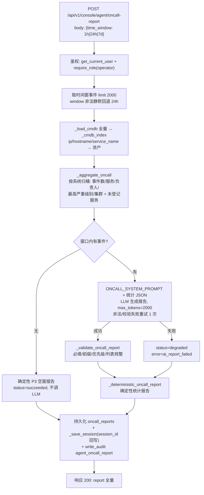
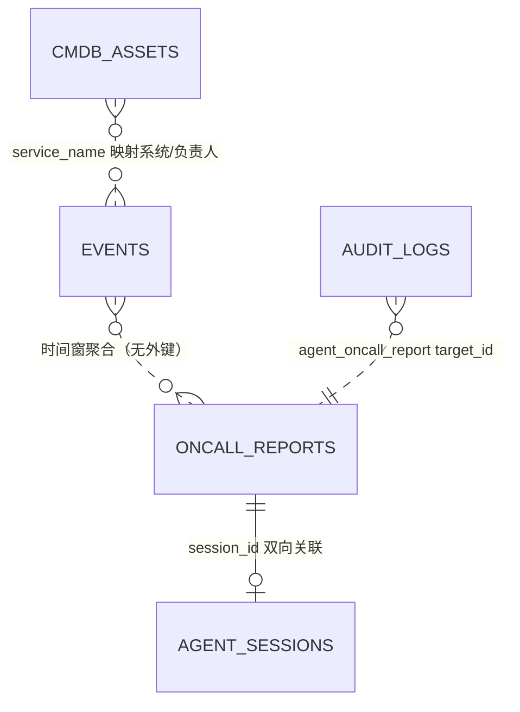

# 值班 Agent（Oncall Agent）现状设计说明书

| 项目 | 内容 |
|------|------|
| 文档版本 | v1.0（现状实录 as-is） |
| 编写日期 | 2026-09-14 |
| 覆盖范围 | `app/backend` 值班 Agent 端到端链路（时间窗聚合 → CMDB 影响面 → AI ChatOps 报告 → 确定性降级 → 报告持久化） |
| 姊妹文档 | 《深度诊断 Agent 现状设计说明书》（`docs/DIAGNOSE_AGENT_DESIGN.md`）、《知识治理 Agent 现状设计说明书》（`docs/KB_GOVERNANCE_AGENT_DESIGN.md`） |

---

## 1. 系统定位与业务目标

值班 Agent 是运营控制台三类运维 Agent 之一，面向**周期性值班交接场景**：按时间窗汇总告警影响面（关联 CMDB 定位系统与负责人），生成一份可直接粘贴到 ChatOps 群的处置报告。

业务目标：

1. **影响面聚合**：把散落的告警事件按"所属系统"归桶，输出各系统的事件数、最高严重级别、涉及服务、负责人；
2. **CMDB 关联**：告警服务自动映射到系统/负责人，未登记服务显式暴露（推动 CMDB 补全）；
3. **ChatOps 即用文本**：产出格式统一（首行【值班告警汇总】）、@负责人、600 字以内的群消息文本，前端一键复制；
4. **优先级判定**：P0~P3 分级，指导值班响应顺序；
5. **确定性降级**：AI 不可用时生成纯统计的确定性报告，值班信息不中断；
6. **报告归档**：每次报告持久化到 `oncall_reports`，支持历史回看与交接审计。

设计哲学：**统计确定性优先、AI 增强表达**——影响面统计全部由代码完成（不依赖模型），LLM 只负责把统计结果"翻译"为有优先级判断和处置建议的可读报告；AI 失败时统计报告照常产出。

---

## 2. 总体架构与运行链路

### 2.1 代码位置

| 职责 | 文件 |
|------|------|
| API 路由（权限校验） | `app/backend/routers/console_agent.py` → `POST /api/v1/console/agent/oncall-report` |
| 聚合 / AI 报告 / 降级 / 编排 | `app/backend/services/console_agent.py` → `_aggregate_oncall` / `_deterministic_oncall_report` / `_validate_oncall_report` / `run_oncall_agent` |
| LLM 接入层 | `app/backend/services/llm_runtime.py` → `llm_chat` |
| 报告模型 | `app/backend/models/oncall_reports.py` |
| CMDB 模型 | `app/backend/models/cmdb_assets.py` |
| 前端入口 | `app/frontend/src/pages/console/AgentsPage.tsx` →「值班报告」Tab |

### 2.2 运行链路



---

## 3. API 契约

### 3.1 生成值班报告

- **端点**：`POST /api/v1/console/agent/oncall-report`
- **权限**：`require_role(db, user, "operator")` —— `operator` 及以上
- **请求体**：`{ "time_window": "24h" }`（`1h` / `24h` / `7d`；**非法值静默回退 24h**，与知识治理 Agent 的 400 行为不同）

- **响应（200）**：

```json
{
  "status": "succeeded | degraded",
  "session_id": 7,
  "message": "值班报告已生成",
  "report": {
    "id": 3,
    "time_window": "24h",
    "event_count": 18,
    "by_severity": {"critical": 5, "warning": 9, "info": 4},
    "affected_systems": [
      {
        "system": "交易系统",
        "event_count": 8,
        "max_severity": "critical",
        "owners": ["张三", "zhangsan@atoms.dev"],
        "clusters": ["prod-cluster-1"],
        "services": [{"service": "payment-service", "count": 5, "max_severity": "critical"}]
      }
    ],
    "unmapped_services": {"some-new-service": 2},
    "impact_summary": "影响面摘要（中文，2~4 句）",
    "priority": "P1",
    "actions": ["处置动作1", "处置动作2"],
    "owners_to_notify": ["zhangsan@atoms.dev"],
    "chatops_text": "【值班告警汇总】\n时间窗: 24h …"
  }
}
```

### 3.2 关联只读接口

| 端点 | 用途 |
|------|------|
| `GET /api/v1/console/agent/oncall-reports?limit=10` | 历史报告列表（前端"历史报告"卡片） |
| `GET /api/v1/console/agent/cmdb?q=` | CMDB 资产查询（影响面的数据源，人工核查登记） |
| `GET /api/v1/console/agent/sessions?session_type=oncall` | 会话轨迹回放 |

---

## 4. 时间窗与影响面聚合算法

### 4.1 时间窗

| time_window | 小时数 | 取数上限 |
|-------------|--------|----------|
| `1h` | 1 | 2000 条 |
| `24h`（默认） | 24 | 2000 条 |
| `7d` | 168 | 2000 条 |

`since = datetime.now(timezone.utc) - delta`；查询 `Events.created_at >= since`，按 `id desc` 取最近 **2000** 条。`time_window` 非法时静默回退 `24h`。

### 4.2 CMDB 索引 `_cmdb_index`

全量加载 `cmdb_assets` 后建索引：`ip`、`hostname`、`service_name` 三个键均指向资产（`setdefault` 先到先得）。事件按 `service_name` 查索引（O(1)）。

### 4.3 聚合规则 `_aggregate_oncall`

对窗口内每条事件：

1. **严重度计数**：`by_severity`（critical/warning/info）；
2. **系统归桶**：`asset = index[service_name]`；命中 → 桶键为 `asset.system_name`；未命中 → 桶键 **"未登记（CMDB 缺失）"**，同时 `unmapped_services[service_name] += 1`；
3. **桶内聚合**：
   - `event_count`：事件总数；
   - `services`：子桶按服务计数，并维护子桶 `max_severity`；
   - `owners`：`asset.owner` 与 `asset.owner_email` 并入集合（去重）；
   - `clusters`：事件的 `cluster` 集合；
   - `max_severity`：按 `SEVERITY_RANK`（critical=3 > warning=2 > info=1）取最高；
4. **输出排序**：系统桶按 `(max_severity 等级, event_count)` 降序；桶内服务按事件数降序。

---

## 5. AI 报告生成

### 5.1 System Prompt（ONCALL_SYSTEM_PROMPT）

输出严格 JSON：

```json
{
  "impact_summary": "影响面摘要（中文，2~4 句）",
  "priority": "P0/P1/P2/P3",
  "actions": ["分步处置动作（按优先级排序）"],
  "owners_to_notify": ["需要通知的负责人"],
  "chatops_text": "可直接粘贴到 ChatOps 群的消息文本（多行）"
}
```

约束要点：

- **优先级判断**：涉及 critical 且影响多个系统 → P0/P1；仅 warning → P2；仅 info → P3；
- 处置动作须结合各系统负责人与已知知识库方案，**必须具体可执行**；
- `chatops_text`：纯文本，**第一行必须以【值班告警汇总】开头**，用换行与序号组织，@负责人用邮箱前缀，全文 ≤ 600 字；
- 只输出一个完整闭合的 JSON 对象。

User Prompt 携带：时间窗 + 完整统计 JSON（`_aggregate_oncall` 输出，`indent=2`）+ 600 字与闭合提醒。

### 5.2 调用与重试

| 项 | 值 |
|----|----|
| `max_tokens` | 2000 |
| 超时 | `llm_timeout_seconds`（默认 45s） |
| 温度 | `llm_temperature`（默认 0.2） |
| 重试 | 输出非法或校验失败时追加纠正消息**重试 1 次**；仍失败抛 `ValueError("模型输出校验失败")` |
| 短路条件 | 窗口内无事件 → **不调用 LLM**，直接生成确定性 P3 空窗报告（status=succeeded） |

### 5.3 输出校验 `_validate_oncall_report`

| 字段 | 规则 |
|------|------|
| `impact_summary` / `chatops_text` | 非空，否则整体判无效 |
| `chatops_text` 前缀 | 不以【值班告警汇总】开头时**自动补前缀**（格式兜底） |
| `priority` | 大写化；不在 {P0,P1,P2,P3} 内回退 **P1** |
| `actions` / `owners_to_notify` | 列表逐项 str/strip，各截前 10 条 |

### 5.4 报告质量评估（Trust Index 口径）

AI 报告生成成功后，立即用与诊断质量同一套启发式比对器（`quality_scan.evaluate_diagnosis_quality`）评估报告质量：

- **Grounding 构造**：CMDB 影响面（系统 / 服务 / 负责人桶）+ 告警窗口摘要作为证据上下文；报告的影响面摘要与处置动作作为待检断言；
- **指标**：Faithfulness / Context Coverage / Answer Relevance / 幻觉率 → `Trust Index = 0.4×Faithfulness + 0.35×Context Coverage + 0.25×(1−幻觉率)`（实现中引用口径以 Context Coverage 度量），单次质量线 **0.85**（`GATE_LINE`）；
- **写入口径**：质量块写入 `report_json.quality`（当前报告与历史报告 API 均返回）与 `agent_sessions.result_json.quality`，审计 `after` 附带 `trust_index`；
- **边界**：空告警窗口不评估（`quality=null`）；评估异常静默降级，不影响报告持久化；
- **与置信度的区别**：值班报告没有置信度自评；Trust Index 是"断言是否能在 CMDB 影响面/告警统计中找到依据"的客观质量分，与诊断 Agent 的主观置信度独立衡量、不构成矛盾。

---

## 6. 确定性降级报告 `_deterministic_oncall_report`

AI 失败（超时 / 网络 / 持续非法输出）时的兜底报告，纯代码构造、必然可用：

- **优先级规则**：`critical >= 3 → P0`；`critical > 0 → P1`；`warning > 0 → P2`；否则 `P3`；
- **chatops_text 组装**（逐行）：
  1. `【值班告警汇总】时间窗: X，共 N 条告警（critical a / warning b / info c）`；
  2. `受影响系统：` + 每系统一行（事件数、最高级别、服务(次数)、负责人 @…，无负责人标"未登记负责人"）；
  3. `CMDB 未登记服务：…`（如有）；
  4. 固定处置建议行（优先处理 critical、按知识库处置清单执行、回写复盘）；
  5. `通知：@负责人…`（如有）；
- `owners_to_notify`：全部系统桶负责人的去重并集。

与 AI 报告的差异：无个性化处置动作与根因分析，但统计数字、受影响系统、负责人、优先级全部准确。

---

## 7. 降级策略矩阵

| 环节 | 失败场景 | 降级行为 | 会话状态 |
|------|----------|----------|----------|
| 取数/聚合 | 数据库异常 | 不吞异常，整体 500 | 不落会话 |
| AI 报告 | LLM 超时 / 网络 / 校验失败（重试 1 次后） | `error_message=ai_report_failed: <type>: <msg>`；切换确定性报告；**报告照常持久化** | `degraded` |
| 校验兜底 | chatops_text 缺前缀 | 自动补【值班告警汇总】 | 不受影响 |
| 空窗口 | 无事件 | 确定性 P3 报告（非降级） | `succeeded` |

核心保证：**只要进入服务层，`oncall_reports` 行与 `agent_sessions` 行必然产生**——值班信息链路"永不空转"。

---

## 8. 报告持久化与会话关联

### 8.1 `oncall_reports` 字段（实际写入值）

| 字段 | 取值 |
|------|------|
| `time_window` | 实际生效窗口（24h 等） |
| `event_count` / `critical_count` / `warning_count` / `info_count` | 窗口统计 |
| `affected_systems` | 聚合结果 JSON（含每系统桶） |
| `report_json` | 报告 JSON（AI 或确定性）；窗口内有事件时额外携带 `quality` 质量指标块（见 5.4） |
| `chatops_text` | 群消息文本（冗余存储，列表页直读） |
| `session_id` | **先落报告（flush 拿到 id）→ 落会话 → 回写 session_id → commit**，双向关联 |
| `actor` | 触发人（邮箱或 ID） |

### 8.2 `agent_sessions`（oncall 会话实际取值）

| 字段 | 取值 |
|------|------|
| `session_type` | `oncall` |
| `status` | `succeeded` / `degraded` |
| `iterations` | 固定 `3`（对应三步轨迹） |
| `tool_trace` | `aggregate_window`（窗口/事件数）→ `cmdb_mapping`（系统数 + 未登记服务列表）→ `ai_report`（ok 或错误信息） |
| `result_json` | `{report_id, priority, impact_summary, quality}`（轻量引用 + 质量指标，报告全文在 oncall_reports） |
| `summary` | `"{priority}：{impact_summary 前 200 字}"` |

### 8.3 审计

`write_audit`：`action=agent_oncall_report`、`target_type=oncall_report`、`target_id=报告 id`、`after={window, events, priority, trust_index, status}`。

---

## 9. 数据模型



### 9.1 `cmdb_assets`

| 字段 | 说明 |
|------|------|
| `hostname` / `ip` | 主机标识（索引键） |
| `system_name` / `service_name` | 系统归属与服务名（聚合桶键 / 索引键） |
| `cluster` / `environment` | 集群与环境 |
| `owner` / `owner_email` | 负责人（影响面 owners 与通知名单来源） |
| `dependencies` | 依赖组件 JSON 数组 |
| `log_path` | 日志路径（诊断 Agent 的核查指引） |
| `status` / `description` | 资产状态与描述 |

演示数据 12 条资产由 `scripts/seed_cmdb_assets.py` 注入。未登记服务不会报错，而是进入 `unmapped_services` 与"未登记（CMDB 缺失）"桶，形成 CMDB 补全的运营信号。

### 9.2 `oncall_reports`

见 §8.1；与 `agent_sessions` 通过 `session_id` 互相可导航（报告 → 会话轨迹；会话 result_json → 报告 id）。

---

## 10. LLM 配置接入

与另外两个 Agent 共用 `llm_runtime`（配置中心实时读库，配置变更立即生效）。全局默认：`llm_provider`（atoms_hub 默认 / openai_compatible）、`llm_model`（默认 `deepseek-v4-flash`）、`llm_temperature`（0.2）、`llm_timeout_seconds`（45）。值班 Agent 支持独立覆盖（留空逐项继承全局）：`oncall_llm_provider` / `oncall_llm_base_url` / `oncall_llm_api_key`（独立接入，可单独切换自建网关）、`oncall_llm_model`、`oncall_temperature`、`oncall_llm_timeout_seconds`。详见《知识治理 Agent 现状设计说明书》§9。

---

## 11. 权限模型

- **触发**：`operator` 及以上（值班运维日常职责）；
- **报告查看**：`viewer` 及以上（`GET /oncall-reports`）；
- **审计身份**：`actor = user.email or user.id`；
- 值班报告不产生写操作（无审批、无知识库变更），因此无需 sre 以上权限，是三个 Agent 中触发门槛最低的一个。

---

## 12. 控制台前端操作路径

页面：`app/frontend/src/pages/console/AgentsPage.tsx` →「值班报告」Tab：

1. **选择时间窗**：下拉 `1h` / `24h` / `7d`（默认 24h）；
2. **运行**：点击生成按钮，运行中提示；
3. **报告展示**：
   - 顶部徽标：优先级（红色高亮 P0/P1）、窗口、告警总数、各级别计数（SeverityBadge×N）；
   - 影响面摘要：AI `impact_summary`；
   - 受影响系统卡片：系统名 / 事件数 / 最高级别 / 负责人 / 集群 / 服务明细；
   - 处置动作列表：`actions` 按序展示；
   - **ChatOps 卡片**：`chatops_text` 等宽字体块完整展示 + **CopyButton 一键复制**（"复制 ChatOps 文本"），可直接粘贴到值班群；
4. **未登记服务提示**：`unmapped_services` 展示，引导补录 CMDB；
5. **历史报告**：列表按时间倒序（ID / 窗口 / 事件计数 / 优先级徽标），点击行**展开/收起**报告全文与 ChatOps 文本，支持交接回看；
6. **会话轨迹 Tab**：`session_type=oncall` 查看三步轨迹与状态。

API 封装：`consoleApi.agentOncallReport(timeWindow)` / `consoleApi.listOncallReports()`。

---

## 13. 典型运行场景

| # | 场景 | 触发条件 | 表现 |
|---|------|----------|------|
| 1 | AI 报告成功 | 窗口有事件且 LLM 正常 | status=succeeded，报告含优先级/处置动作/通知名单/ChatOps 文本 |
| 2 | 空窗口 | 窗口内无事件 | 不调 LLM，直接 P3 空窗报告（"窗口内无告警，一切正常"），status=succeeded |
| 3 | AI 降级 | LLM 超时/非法输出 | status=degraded，确定性统计报告（含准确的系统/负责人/优先级），message 提示降级 |
| 4 | CMDB 部分未登记 | 事件服务不在资产库 | 系统桶归入"未登记（CMDB 缺失）"，unmapped_services 计数暴露 |
| 5 | 负责人缺失 | 资产无 owner | 桶 owners 为空，报告标注"未登记负责人" |
| 6 | 非法 time_window | 如传入 `30d` | 静默按 24h 执行（不报错） |
| 7 | 数据库异常 | 如序列冲突类故障 | 整体 500，报告与会话均不落库（依赖后端日志定位） |

---

## 14. 已知问题、风险、监控指标与改进建议

### 14.1 已知问题与风险

| # | 问题/风险 | 影响 | 缓解现状 |
|---|-----------|------|----------|
| 1 | 非法 `time_window` 静默回退 24h | 与知识治理 Agent（400）行为不一致，调用方不易察觉 | 响应中 `report.time_window` 反映实际窗口 |
| 2 | AI 优先级规则（prompt 语义）与确定性规则（critical≥3→P0）存在粒度差异 | 降级切换时同一数据可能得出不同优先级 | 校验器兜底 P1 回退；规则差异可接受（确定性规则更保守） |
| 3 | 事件取数上限 2000 条 | 超大规模窗口统计不完整 | 演示与常规值班窗口远低于上限 |
| 4 | `unmapped_services` 仅计数 | 未引导具体登记动作 | 前端展示 + CMDB Tab 可手动登记 |
| 5 | 无同比/环比（未对比上一时间窗） | 值班交接缺少趋势信息 | 确定性统计已够用；改进见 §14.3 |
| 6 | 会话 result_json 仅存 report_id/priority/impact_summary | 会话单点回放看不到全文 | 经 session_id 关联 oncall_reports 取全文 |
| 7 | 优先级判定依赖 LLM 自觉遵守 prompt 规则 | 偶发偏差 | 校验器仅兜底合法值，不强制重算 |

### 14.2 监控建议

| 指标 | 来源 |
|------|------|
| 报告生成数 / degraded 率 | `oncall_reports` 行数、`agent_sessions(session_type=oncall)` 按 status 聚合 |
| 优先级分布 | `report_json->priority` 或审计 after.priority |
| 未登记服务规模 | `affected_systems` JSON 内"未登记（CMDB 缺失）"桶与 unmapped_services 计数 |
| 空窗率 | event_count=0 的报告占比（监控接入健康度） |
| AI 报告耗时 | `agent_sessions.duration_ms` 分位数 |
| 降级原因 | `agent_sessions.error_message like 'ai_report_failed%'` 分类计数 |

### 14.3 后续改进建议（按优先级）

1. **趋势对比**：聚合时并行取上一窗口统计，报告增加"较上一时段 +N/-N"与新增系统标注；
2. **优先级规则统一**：校验器按确定性规则重算 priority，与 AI 判定不一致时以规则为准并留痕；
3. **非法窗口显式 400**：与知识治理 Agent 对齐参数校验行为；
4. **通知集成**：owners_to_notify 对接 ChatOps Webhook/邮件（需新增集成配置），实现一键推送；
5. **报告模板参数化**：chatops_text 首行标记、字数上限等移入配置中心；
6. **token usage 入会话**：`llm_chat` 已返回 usage，透传记录成本。

---

## 附录 A：关键配置项速查

| 配置键（console_configs） | 默认 | 与值班 Agent 的关系 |
|---------------------------|------|---------------------|
| `llm_model` | `deepseek-v4-flash` | 报告生成模型 |
| `llm_timeout_seconds` | `45` | 单次调用超时 |
| `llm_temperature` | `0.2` | 采样温度 |
| `llm_provider` / `llm_base_url` / `llm_api_key` | `atoms_hub` | 全局默认接入方式 |
| `oncall_llm_provider` / `oncall_llm_base_url` / `oncall_llm_api_key` | 空 | 值班 Agent 独立接入（留空逐项继承全局） |
| `oncall_llm_model` / `oncall_temperature` / `oncall_llm_timeout_seconds` | 空 | 值班 Agent 独立模型/温度/超时（留空继承全局） |

## 附录 B：复现命令（演示环境）

```bash
TOKEN=$(curl -s -X POST http://localhost:8000/api/v1/auth/demo-login \
  -H "Content-Type: application/json" \
  -d '{"email": "demo-operator@atoms.dev"}' | python3 -c "import sys,json;print(json.load(sys.stdin)['token'])")

# 生成 24h 值班报告
curl -s -X POST http://localhost:8000/api/v1/console/agent/oncall-report \
  -H "Authorization: Bearer $TOKEN" -H "Content-Type: application/json" \
  -d '{"time_window":"24h"}'

# 历史报告
curl -s "http://localhost:8000/api/v1/console/agent/oncall-reports?limit=5" \
  -H "Authorization: Bearer $TOKEN"
```
